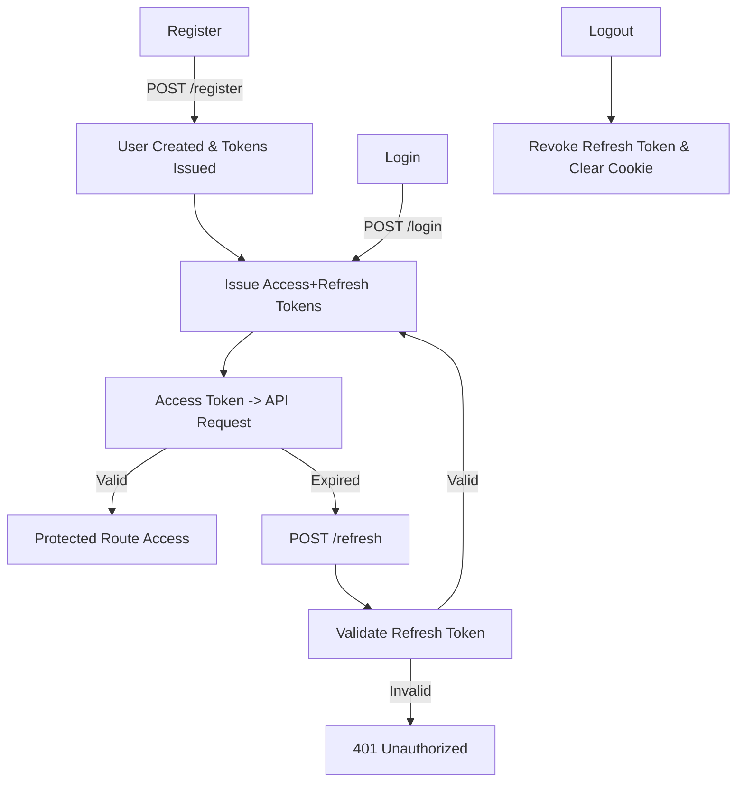

## Authentication & Authorization

### Features

- JWT-based authentication with **Access Token** (short-lived) and **Refresh Token** (long-lived, rotation enabled).
- Hashed storage of refresh tokens for security.
- Role-based authorization middleware (`authGuard`, `roleGuard`).
- Per-device refresh token tracking (IP + userAgent).
- Secure HTTP-only cookies for refresh tokens.
- Token revocation and rotation.
- Brute-force and rate-limit protection on sensitive endpoints.
- Extensible to support OTP verification and 2FA.

### Roadmap Plan

**Day 1-2:** Implement User schema, registration with password hashing, validation.  
**Day 3:** Implement login with JWT issuance, refresh token storage, rotation, secure cookies.  
**Day 4:** Implement `authGuard` and `roleGuard` middleware for role-based access control.  
**Day 5:** Apply rate limits, helmet, and security hardening for auth routes.  
**Day 6:** Implement password reset and forgot password flow.  
**Day 7:** Testing — unit tests for services/middleware and E2E tests for login and protected routes.

### Flow

1. **Register**
   - User submits registration details → Server validates and hashes password → User record created → Access + Refresh tokens issued (auto-login).
2. **Login**
   - User submits credentials → Server validates → Access + Refresh tokens issued.
   - Access token sent in response body, refresh token set as secure HttpOnly cookie.
3. **Access Protected Routes**
   - Client sends `Authorization: Bearer <accessToken>` → `authGuard` validates token → Request proceeds.
4. **Refresh Token**
   - When access token expires, client calls refresh endpoint → Server validates stored refresh token → Issues new Access + Refresh tokens.
5. **Logout**
   - Client calls logout → Refresh token revoked in DB → Cookie cleared.

### Flow Diagram

### Notes for Devs

- Always hash refresh tokens before storing them.
- Access tokens should be short-lived (e.g., 15 minutes).
- Refresh tokens should be rotated on each use.
- Role checks should be enforced using `roleGuard` middleware.
- Keep security middlewares (helmet, rate-limiters) active on auth routes.
- `register` response includes `isNewUser: true` to indicate auto-login from registration flow.

### Plan for This Week — Auth & AuthZ, Auth Architecture, Schema

**Day 1: Requirements & Architecture**

- Finalize authentication & authorization requirements (Access + Refresh tokens, role management, per-device tracking).
- Create architecture diagram showing token flow, middleware layers, and database interaction.
- Decide on schema fields for User model and Refresh Token subdocument.

**Day 2: User Schema & Model Setup**

- Implement `User` Mongoose schema with hashed password storage.
- Add fields for email, phone, role, verification status, and embedded refresh token documents.
- Create utility methods for password hashing and validation.

**Day 3: Auth Services & Token Management**

- Implement `authService` for register, login, refresh token rotation, and logout.
- Add helpers for signing/verifying access & refresh JWTs.
- Integrate refresh token hashing & storage.

**Day 4: Middleware Layer**

- Implement `authGuard` for route protection.
- Implement `roleGuard` for role-based access.
- Apply rate limiting and helmet configuration for auth routes.

**Day 5: Testing & Verification**

- Write Postman collection for all auth endpoints.
- Unit test `authService` and middleware.
- Test token rotation and per-device logout.

**Day 6-7: Extensions & Cleanup**

- Implement forgot-password and reset-password flows.
- Add optional OTP/2FA support for seller/admin roles.
- Document API contract and update README.

### Stories

| Story                                  | Priority | Story Point | Milestone | Description                                                                                                                          |
| -------------------------------------- | -------- | ----------- | --------- | ------------------------------------------------------------------------------------------------------------------------------------ |
| Implement User Schema & Model          | High     | 5           | M1        | Create Mongoose schema for User with secure password hashing and refresh token subdocument.                                          |
| Registration API                       | High     | 3           | M1        | Build registration endpoint with validation, hashed password storage, and immediate token issuance (auto-login with isNewUser flag). |
| Login API with Access & Refresh Tokens | High     | 5           | M1        | Create login route issuing short-lived access token and long-lived refresh token in secure cookie.                                   |
| Token Refresh Endpoint                 | High     | 3           | M1        | Implement endpoint to validate and rotate refresh tokens.                                                                            |
| Auth Middleware (authGuard, roleGuard) | Medium   | 3           | M2        | Create middleware to protect routes and enforce role-based access.                                                                   |
| Security Enhancements                  | Medium   | 2           | M2        | Apply helmet, rate limiter, and input sanitization on auth routes.                                                                   |
| Forgot & Reset Password Flow           | Low      | 3           | M3        | Implement password reset token flow with email delivery.                                                                             |
| OTP/2FA Integration                    | Low      | 5           | M3        | Add optional second factor for seller/admin accounts.                                                                                |
| Testing & Postman Collection           | High     | 3           | M2        | Prepare automated and manual test coverage for all auth endpoints.                                                                   |
